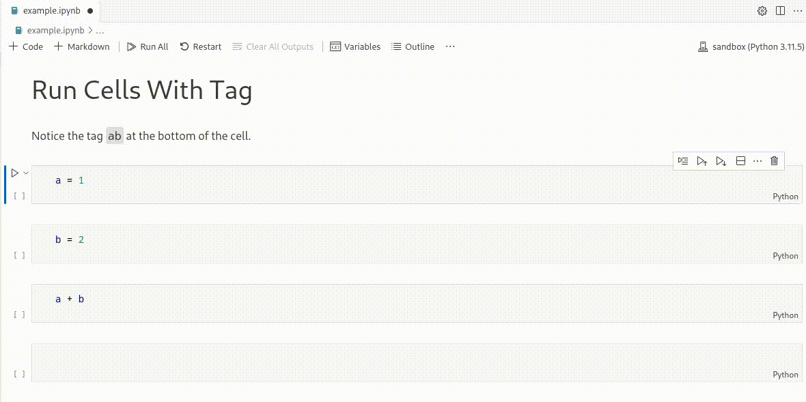

# RunCellsWithTag

RunCellsWithTag is a Visual Studio Code extension that allows users to efficiently run notebook cells based on specified tags. This feature is especially useful for managing large notebooks by quickly executing relevant sections.

## Features

This extension enables you to run cells with a specified tag. This can come in handy, for example, in longer notebooks where you want to run some initialization cells quickly.

**Benefits:**
- Quickly execute setup or initialization cells.
- Focus on specific sections of your notebook without running everything.

## Installation

You can install the **RunCellsWithTag** extension directly from the Visual Studio Code Marketplace or by searching for it in the Extensions view (`Ctrl + Shift + X` or `Cmd + Shift + X`).

## How to use?

1. Add some tags to your notebook cells. Cells can have multiple tags, no problem.
2. Open **Command Palette**: Press `Ctrl + Shift + P` (or `Cmd + Shift + P` on macOS).
3. Start typing `Run Cells With Tag` and select the command.
4. Type the name of the tag and press `Enter`.

> Tip: This extension works best together with [Jupyter Cell Tags](https://marketplace.visualstudio.com/items?itemName=ms-toolsai.vscode-jupyter-cell-tags) extension.

## Troubleshooting

- If no cells are executed, ensure that the tags are correctly assigned to the notebook cells.
- Check the case sensitivity of the tags when entering them in the command palette.

## Release Notes

### 1.0.0

Initial release of RunCellsWithTag

## License

This project is licensed under the MIT License - see the [LICENSE](LICENSE) file for details.

## Feedback

If you have any questions or feedback, feel free to reach out on [GitHub](https://github.com/jantomec).
